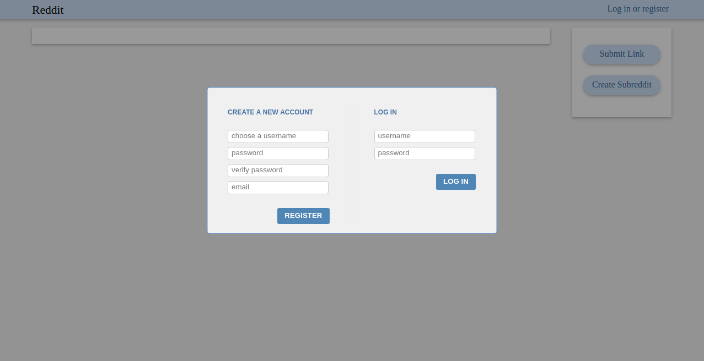

Todoapp build with ASP NET CORE + Angular2. A lot of the frontend done, but not at all usable yet

Uses

* [JavaScriptServices](https://github.com/aspnet/JavaScriptServices)

#### Run

Working Dockerfile!

Build with

`docker build . -t reddit_spa`

Run with

`docker run -p 5000:5000 reddit_spa`